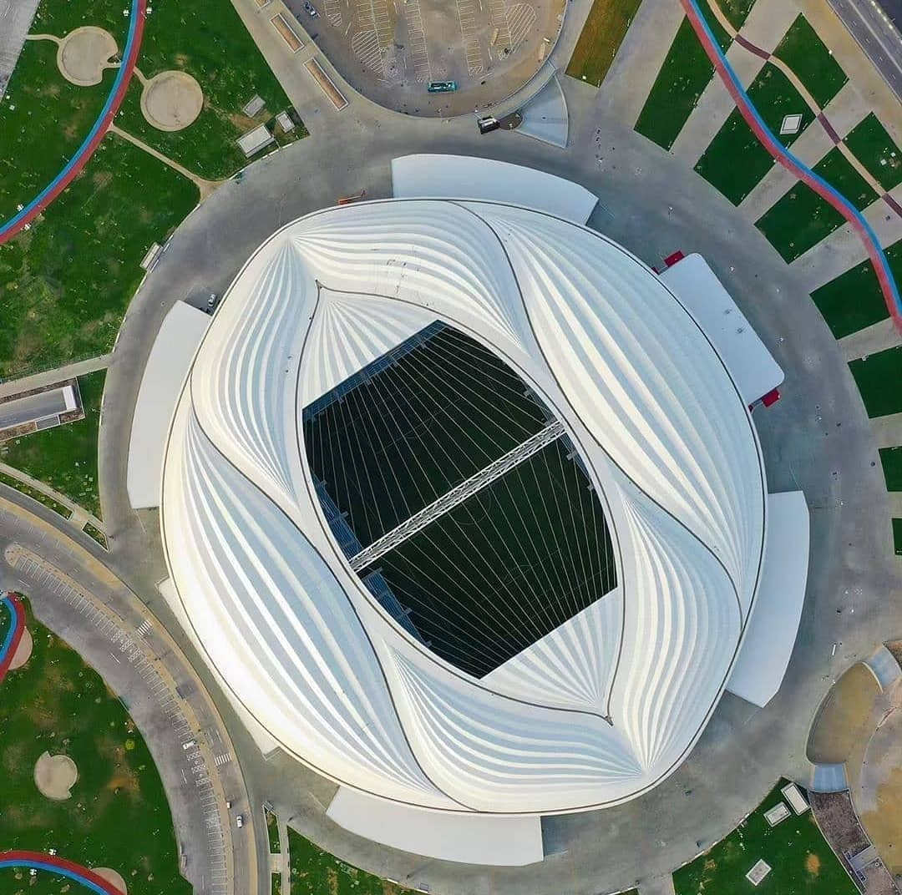

# Fifa IA predictora de la copa mundial



## Descripción

Con base a partidos amistosos, y mundiales pasados este código nos ayuda a poder predecir cual va a ser el resultado del mundial.


 

## Estructura

(Arbol del Proyecto)

## Ejecucion

Para ejecutar nuestro programa, escribimos:

```sh
abrimos el archivo de algoritmo de prediccion
```
## Datos del equipo

Integrantes:

- David Pérez Jacome              - 316330420

# Proyecto-de-IA
